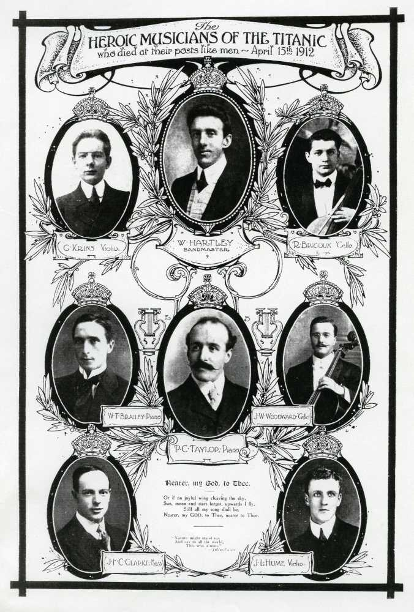

# Econ520Project
## Background: 
This is a repo for Finn Owsley, Scott Masterson, and Sofia Lozano's final project. :ship: Hello! Our research is on the long-sunken Titanic. We estimate the effect of passenger class on survival rate. :ship: You can find all relevant files in the folder. This project includes: 

- Latex code for the report
- pdf version of the report 
- File for replication
- Bib file
- CSV file with our compiled dataset 

### Context: 
This project was created to put into practice the skills learned in ECON 520: Data Science for Economics. (Causal inference, mainly linear regressions, Regression Adjustments, and Bootstrap). 
We use interaction terms to look at heterogeneity analysis. 

### Findings:
Our main findings are that being a first-class passenger had a positive statistically significant effect on survival. 

### How to Replicate the Findings
1. Download titanic_Dataset.csv from the Files
2. Download titanic_Replication.py and access it in your python enviornment
3. Run the results in titanic_replication.py (you will need to change the name of the filepath where titanic_Dataset.csv is located in order to input the data)
...

If you have any questions or want to contribute to this project reach out. 
sofia.lozano@emory.edu

